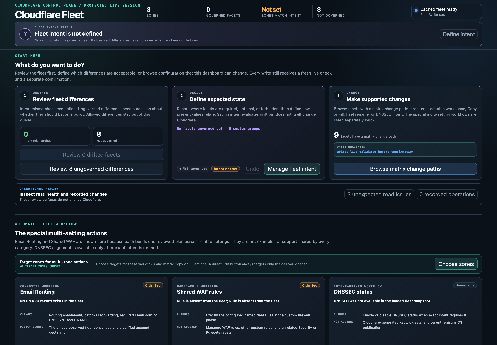
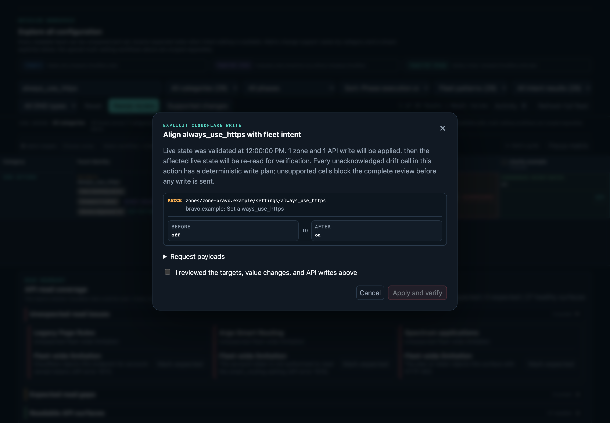

# Cloudflare Fleet

Cloudflare Fleet is a self-hosted control plane for auditing and aligning Cloudflare zones. It turns settings, DNS, DNSSEC, Email Routing, rules, and account resources into one comparable matrix; lets operators define expected state for exact zone scopes; and keeps supported mutations behind fresh reads, exact plans, human confirmation, durable activity, and scoped verification.



The same browser application runs in two modes:

- An Access-protected Cloudflare Worker with D1 persistence for hosted access
- An ephemeral local loopback broker on macOS for a complete local workflow

Neither mode exposes the Cloudflare API token to browser JavaScript. Hosted configuration defaults to read-only, and local capabilities remain available after a hosted deployment.

## What Fleet does

- Compares normalized configuration across every selected zone without hiding raw source values
- Separates observed differences from saved fleet intent, acknowledged exceptions, and expected coverage gaps
- Turns supported exact and forbidden intent into first-class cell, row, and policy alignment reviews
- Models compatibility domains as strict canonical passthrough intent that rejects independent web behavior
- Audits core fleet posture in Markdown, JSON, or self-contained HTML, with an optional deep account and endpoint pass
- Plans direct settings, DNS, DNSSEC, Email Routing, and ruleset changes through endpoint-specific adapters
- Displays targets, before and after values, methods, endpoints, and request bodies before a write
- Saves pending activity before mutation, verifies authoritative resources afterward, and offers guarded undo only when the inverse is lossless
- Keeps the hosted Cloudflare proxy inside explicit read and write allowlists

The [documentation site](https://docs.cloudflare-fleet.lasers.app) includes a copyable [getting-started guide](https://docs.cloudflare-fleet.lasers.app/getting-started), the complete [architecture](https://docs.cloudflare-fleet.lasers.app/architecture), [deployment guide](https://docs.cloudflare-fleet.lasers.app/deployment), [security model](https://docs.cloudflare-fleet.lasers.app/security), screenshots, and accessible visual diagrams.

## Quick start

Node.js 22 or newer is required. Install a tagged GitHub source package so the command is copied into npm's global prefix and remains usable if a checkout is moved or deleted. Choose the tag from [GitHub Releases](https://github.com/j-256/cloudflare-fleet/releases).

```sh
npm install --global "github:j-256/cloudflare-fleet#v0.1.0"

export CLOUDFLARE_API_TOKEN="your-account-token"
export CLOUDFLARE_ACCOUNT_ID="your-account-id"

cloudflare-fleet doctor --live
cloudflare-fleet audit
```

The first command installs the canonical `cloudflare-fleet` CLI, the macOS dashboard launcher, and the stdio MCP server as one versioned package. Fleet remains private on the npm registry to prevent accidental publication; tagged GitHub source is the supported distribution channel.

Do not use `npm install --global .` for a durable installation. npm normally links that command back to the current checkout, so moving or deleting the clone breaks the global executable. Contributors can use the checkout-local npm scripts and `./launch.sh`, or install a tagged GitHub source package alongside the checkout.

## Credentials and permissions

Fleet reads `CLOUDFLARE_API_TOKEN` and `CLOUDFLARE_ACCOUNT_ID` from the launching environment. Put them in your shell's secret-loading workflow or secret manager, not in this repository, an MCP file with literal values, or a committed dotenv file.

Create a token scoped to only the intended account and zones. `Zone Read` is the baseline for `doctor --live` and zone discovery. Complete inventory calls product-specific surfaces, so add the matching groups for the products you use, commonly `Zone Settings Read`, `DNS Read`, `Email Routing Rules Read`, `Zone WAF Read`, `Workers Routes Read`, `Firewall Services Read`, `Health Checks`, and `Load Balancers`. Canonical alias coverage also reads zone Worker routes, SSL for SaaS custom hostnames, rulesets, load balancers, health checks, waiting rooms, Web3 hostnames, snippets, plus account Workers custom domains and Pages projects. Missing optional access remains visible as coverage evidence instead of being treated as trustworthy absence.

Keep the token read-only unless you plan to use reviewed writes. Supported mutations commonly require the corresponding `Zone Settings Write`, `DNS Write`, `Email Routing Rules Edit`, or `Zone WAF Write` group. Deep audit account surfaces can require additional account-level read groups for Workers, Pages, D1, KV, R2, Queues, Workflows, and Registrar. Cloudflare maintains the authoritative [API token permission groups](https://developers.cloudflare.com/fundamentals/api/reference/permissions/); rerun the audit after changing a token so its actual coverage is explicit.

## Configuration and profiles

No configuration file is required for a first run. These commands explain the effective paths, credential presence, local dependencies, and file safety without printing either credential value:

```sh
cloudflare-fleet config show
cloudflare-fleet doctor
cloudflare-fleet doctor --live
```

State and policy are operator data, not package data. They survive installation, updates, and uninstallation. State defaults to `$XDG_STATE_HOME/cloudflare-fleet/state.json` or `~/.local/state/cloudflare-fleet/state.json`; policy defaults to `$XDG_CONFIG_HOME/cloudflare-fleet/fleet-policy.json` or `~/.config/cloudflare-fleet/fleet-policy.json`. Files Fleet creates use mode `0600`, and `doctor` warns about unsafe existing permissions or symbolic links.

Path precedence is command flag, Fleet environment variable, XDG environment variable, then per-user default. Fleet-specific environment paths must be absolute:

```sh
export CLOUDFLARE_FLEET_STATE_FILE="$HOME/.local/state/cloudflare-fleet/production.json"
export CLOUDFLARE_FLEET_POLICY_FILE="$HOME/.config/cloudflare-fleet/production-policy.json"
cloudflare-fleet config show
```

Use `--state-file` and `--policy-file` for a one-command profile instead. The example policy is [`fleet-policy.example.json`](fleet-policy.example.json); copy it to the path reported by `config show` only when an operator exception is needed. Live state, policy, deployment configuration, and secrets stay untracked.

## Local dashboard

The local dashboard requires macOS, `jq`, `curl`, a Chromium-compatible browser, and the normal account credentials. It starts read-only when no mode flag is supplied:

```sh
cloudflare-fleet dashboard
```

Use `cloudflare-fleet dashboard --write` only when you intend to review and apply supported changes. The launcher opens a normal browser tab through a random loopback broker, persists intent and activity to the selected state file, and removes its private runtime after the last dashboard connection closes. `./launch.sh` accepts the same options from a source checkout and also defaults to read-only.

Use `cloudflare-fleet dashboard --fresh` to bypass the inventory cache for one launch. Debug mode is intentionally separate: `cloudflare-fleet dashboard --debug-port 9224` creates an isolated browser profile with direct Cloudflare transport for development and browser automation; it cannot persist intent or activity through the broker.

## Read-only audit

The CLI reads live Cloudflare inventory and configured Fleet state without sending mutations. Progress goes to stderr so stdout remains pipeable.

```sh
cloudflare-fleet audit
cloudflare-fleet audit --format json
cloudflare-fleet audit --format html > audit.html
cloudflare-fleet audit --deep --fail-on warning
```

Core findings cover inventory gaps, fleet intent, canonical alias behavior and attachments, DNSSEC transitions, Email Routing policy, shared WAF rules, editable settings, TLS and certificate posture, duplicate DNS, mail policy, and ruleset health. Deep mode adds bounded public DNS, endpoint, Registrar, Pages, Workers, storage, binding, route, and dependency evidence. Use `--state-file` or `--policy-file` to select explicit documents.

`--fail-on` exits with a distinct policy status after rendering the complete report. Authentication, inventory, argument, and rendering failures remain operational errors. The deep audit is a point-in-time review of every proxied exact hostname; it does not schedule probes or retain endpoint state.

## Hosted deployment

Hosted Fleet needs a source checkout, Cloudflare zone, D1 database, self-hosted Access application, custom-domain Worker, and account API token.

```sh
git clone --branch v0.1.0 --depth 1 https://github.com/j-256/cloudflare-fleet.git
cd cloudflare-fleet
npm ci
npx wrangler d1 create cloudflare-fleet

cloudflare-fleet hosted configure \
  --account-id "$CLOUDFLARE_ACCOUNT_ID" \
  --database-id "$CLOUDFLARE_FLEET_D1_DATABASE_ID" \
  --hostname fleet.example.com \
  --access-aud "$CLOUDFLARE_ACCESS_AUD" \
  --access-team-domain "$CLOUDFLARE_ACCESS_TEAM_DOMAIN"

npm run db:migrate:remote
umask 077
printf 'CLOUDFLARE_API_TOKEN="%s"\n' "$CLOUDFLARE_API_TOKEN" > .dev.vars.production
npm run deploy -- --secrets-file .dev.vars.production
```

The generator writes ignored, mode-restricted `wrangler.jsonc` and defaults it to backend-enforced read-only mode. See the [deployment guide](docs/deployment.html) for Access setup, secret handling, verification, optional state import, and the deliberate `--write` opt-in.

`wrangler.example.jsonc` documents the portable binding shape. `fleet-policy.example.json` documents optional typed operator exceptions. Live account IDs, D1 IDs, Access values, policy exceptions, fleet state, and secrets do not belong in Git.

## Operator CLI and MCP

The fleet CLI exposes the dashboard's complete headless operator contract: audit, intent persistence, intent alignment, bounded direct changes, durable activity, guarded undo, hosted configuration, and state import. Text is the default for operators; `--format json` emits one structured JSON document on stdout while progress and diagnostics remain on stderr.

```sh
cloudflare-fleet alignment list --format json
cloudflare-fleet alignment plan --policy POLICY_ID --format json
cloudflare-fleet alignment apply --policy POLICY_ID \
  --expect-plan 'sha256:...' --format json

umask 077
cloudflare-fleet intent show > fleet-intent.json
cloudflare-fleet intent aliases --format json
cloudflare-fleet intent plan --input fleet-intent.json --format json
cloudflare-fleet intent apply --input fleet-intent.json \
  --expect-plan 'sha256:...' --format json

cloudflare-fleet schema change > fleet-change.schema.json
cloudflare-fleet change plan --input change.json --format json
cloudflare-fleet change apply --input change.json \
  --expect-plan 'sha256:...' --format json

cloudflare-fleet activity list --format json
cloudflare-fleet activity undo plan --id ACTIVITY_ID --format json
cloudflare-fleet activity undo apply --id ACTIVITY_ID \
  --expect-plan 'sha256:...' --format json
```

Select an alignment policy with `--policy ID`, a complete matrix row with `--category CATEGORY --key KEY [--phase PHASE]`, or repeat `--zone-id ID` with a row selector to target cells. `intent show` emits an editable complete document in text mode; intent apply validates its account and revision, computes collection-level differences, and persists it atomically only if the reviewed digest still matches. `schema change` describes the discriminated direct-change vocabulary for settings, DNS, Email Routing, rulesets, safe copies, fleet rename, and shared-policy alignment. It accepts operator outcomes and identifiers, never arbitrary HTTP methods or API paths.

Every Cloudflare apply repeats fresh scoped planning inside the exclusive write lock, writes a pending activity record before mutation, executes in order, and verifies authoritative resources afterward. Guarded undo is available only for a lossless inverse and is blocked when fresh reads differ from the recorded post-write state. The CLI is deliberately noninteractive, so its caller is responsible for presenting and approving the complete plan before passing the digest.

The stable exit contract is documented by `cloudflare-fleet --help`: success is `0`, runtime failure is `1`, invalid usage is `2`, a missing dependency is `3`, blocked or attention-required outcomes are `4`, a changed plan is `5`, a write failure is `6`, and a verification failure is `7`.

The local stdio MCP server gives compatible agents a narrower tool surface than a raw Cloudflare API proxy. It is part of the same installed package:

```sh
cloudflare-fleet mcp
```

Start with `get_runtime_status` after connecting. It returns the same redacted path, credential-presence, dependency, and optional live-access diagnosis as `cloudflare-fleet doctor`, so an agent can explain missing setup before attempting fleet work.

### Codex

Add the server to `~/.codex/config.toml` and explicitly forward the two credential variables from the environment that launches Codex:

```toml
[mcp_servers.cloudflare_fleet]
command = "cloudflare-fleet"
args = ["mcp"]
env_vars = ["CLOUDFLARE_API_TOKEN", "CLOUDFLARE_ACCOUNT_ID"]
```

Run `codex mcp list` to inspect the configured server, then use `/mcp` in a Codex session and ask Fleet for `get_runtime_status`. Codex documents the stdio fields in its [MCP configuration guide](https://developers.openai.com/codex/mcp).

### Claude Code

Register the command at user scope so it is available across projects, then launch Claude Code from the shell that exports the credentials:

```sh
claude mcp add --transport stdio --scope user cloudflare-fleet -- cloudflare-fleet mcp
claude mcp list
```

Use `/mcp` in a Claude Code session to inspect the connection and ask Fleet for `get_runtime_status`. The registration stores the command and arguments, not literal credential values. Claude Code documents scopes, stdio registration, and environment expansion in its [MCP guide](https://code.claude.com/docs/en/mcp).

### Other MCP clients

Use the standard stdio command-plus-arguments shape and arrange for the client process to inherit the credentials:

```json
{
  "mcpServers": {
    "cloudflare-fleet": {
      "command": "cloudflare-fleet",
      "args": ["mcp"]
    }
  }
}
```

For an explicit profile, append `--state-file /absolute/path/state.json` and `--policy-file /absolute/path/fleet-policy.json` to the MCP arguments. In Codex, add those strings to `args`; in Claude Code, place them after `cloudflare-fleet mcp` in the registration command.

The server registers diagnostic, read, plan, and apply tools for fleet audit, complete intent persistence, single or batched intent alignment, bounded direct changes, activity inspection, and guarded undo. Mutation tools display the exact request, digest, and operations through MCP input elicitation, require explicit approval, authenticate short-lived method-bound confirmation state, and call the service's fresh apply path. Tool results include typed structured content plus an equivalent serialized JSON text block for clients that have not adopted structured results. Tool-specific output schemas describe the meaningful result fields instead of one generic envelope.

- Diagnose: `get_runtime_status`
- Read: `audit_fleet`, `describe_zone_alias_policy`, `get_fleet_intent`, `list_alignment_candidates`, and `list_activity`
- Plan: `plan_fleet_intent`, `plan_alignment`, `plan_fleet_change`, and `plan_activity_undo`
- Apply: `apply_fleet_intent`, `apply_alignment`, `apply_alignments`, `apply_fleet_change`, and `apply_activity_undo`

Read and plan tools work without interactive approval. Apply tools additionally require an MCP client that supports input elicitation; if the client does not present the elicitation, use the CLI or dashboard to review and apply the same bounded plan.

A short-lived, intent-revision-bound baseline avoids repeating the complete alignment candidate inventory, but fresh membership and selected surfaces are still reread. Protocol messages use stdout and diagnostics use stderr. The package version is reported consistently by the CLI, package metadata, and MCP server identity.

Cloudflare GET requests honor `Retry-After` when the API returns HTTP 429. Exhausted throttling fails the inventory operation instead of presenting partial coverage as trustworthy drift, and mutating requests are never automatically retried.

The CLI and MCP process inherit `CLOUDFLARE_API_TOKEN` and `CLOUDFLARE_ACCOUNT_ID`. Keep the token in the launching process environment instead of a tracked or shared client configuration. Durable per-user state and policy paths are independent of the npm installation, so reinstalling the binary cannot replace operator data. These direct local processes hold the token's authority, and their JSON, audit, plan, and activity output can contain sensitive fleet configuration.

## Daily operating loop

Use diagnostics and an audit before opening a write-capable surface, especially after changing credentials, profiles, or versions:

```sh
cloudflare-fleet doctor --live
cloudflare-fleet audit --fail-on warning
cloudflare-fleet dashboard
```

The dashboard command is read-only by default. When a supported correction is needed, either relaunch with `--write` and use the visual confirmation or use a CLI/MCP plan followed by its digest-bound apply command. Inspect the durable result and guarded recovery options with `cloudflare-fleet activity list` and `cloudflare-fleet activity undo plan --id ACTIVITY_ID`.

Use `cloudflare-fleet config show` whenever profile selection is unclear, `cloudflare-fleet dashboard --fresh` when the next browser session must bypass cached inventory, and `cloudflare-fleet audit --deep` for a broader point-in-time account and endpoint review.

## Update or uninstall

Choose a newer tag from [GitHub Releases](https://github.com/j-256/cloudflare-fleet/releases), install it over the existing package, and rerun the live doctor:

```sh
npm install --global "github:j-256/cloudflare-fleet#v0.1.0"
cloudflare-fleet --version
cloudflare-fleet doctor --live
```

Remove only the installed program with `npm uninstall --global cloudflare-fleet`. npm does not remove the state and policy paths reported by `cloudflare-fleet config show`, so an uninstall or reinstall cannot silently discard fleet intent or activity.

## Fleet intent and writes

Fleet intent defines presence and value constraints independently. Broader groups act as baselines, contained groups refine them, and partial overlaps remain peers. Exact acknowledgements bind one policy, zone, and observed normalized value, then become stale if that context changes. Saving intent evaluates drift but never writes Cloudflare.

The typed `Zone aliases / canonical-web-passthrough` facet is an opt-in policy for compatibility domains. It is fixed to required presence and exact value: status, target scheme and host, path preservation, query preservation, subdomain matching, subdomain preservation, serving apex and wildcard DNS, and an empty unexpected-resource envelope all participate in equality. `cloudflare-fleet intent aliases --format json` and the MCP `describe_zone_alias_policy` tool return reusable values plus initial templates for `j256.dev`, `strangelaser.com`, and `strangelasers.net`; the dashboard loads the matching template when one of those zones is selected.

The `canonicalization-dns-mail-security-v1` envelope allows proxied apex and wildcard DNS used by the redirect, non-web and mail or ownership-verification DNS, one canonical dynamic redirect, ordinary TLS and zone posture, and shared security rulesets. Additional web-serving DNS, redirects, application rules, Worker routes or custom domains, Pages domains, SSL for SaaS custom hostnames, load balancers, health checks, waiting rooms, Web3 hostnames, and snippets are reported individually with the canonical target as owner evidence. A failed relevant read blocks alignment. Legacy Page Rules remain an explicit coverage limitation because Cloudflare rejects that endpoint for account-owned tokens, so Fleet never presents their absence as proven.

Alias cleanup reuses the ordinary alignment state machine. Fleet can edit or create the canonical redirect and remove only extra DNS records or rules that have lossless inverse adapters. Required serving DNS and the selected canonical rule are never collateral cleanup targets; unsupported attachments block the complete alignment and direct the operator to the product-specific workflow.

Review alignment appears on a supported policy, matrix row, and individual drifting cell. Exact intent can edit supported zone settings, Email Routing's `skip_wizard` and `support_subaddress` settings, DNS records, DNSSEC status, API-managed Email Routing rules, redirects, and ruleset rules, and it can fill missing DNS records and portable rules from a matching fleet source. Forbidden intent can remove supported DNS records and rules through reversible adapters. Conflicts, must-differ choices, required values without an exact expectation, missing portable sources, generated resources, and unsupported endpoint shapes stay visibly blocked with their exact reason beside the disabled action.

A row or policy review is all-or-nothing: every unacknowledged drift cell in that action scope must have a deterministic adapter. A cell review deliberately narrows the requested change to one zone. Both forms reread the relevant facet across every account zone, reject changed fleet membership or incomplete reads, reevaluate the latest saved intent, and only then build the confirmation.



Endpoint adapters strip server fields, preserve target-specific identity, and refuse unsupported shapes. The confirmation contains the live validation time, affected zones, current and desired values, methods, endpoints, and payloads. A pending activity record is durable before execution. Verification rereads exact affected resources and patches the matrix and persistent snapshot once.

Clearing or bypassing the inventory cache never removes intent or activity. Hosted sessions use transactional D1 state; local sessions use revisioned sections in the ignored account-scoped state file.

## Documentation and screenshots

The official documentation is published at [docs.cloudflare-fleet.lasers.app](https://docs.cloudflare-fleet.lasers.app). Its dependency-free source lives under [`docs/`](docs/), and every clone can preview and build the same static artifact locally:

```sh
npm run docs:serve
```

The tracked Workers Static Assets configuration contains no account identifier, custom domain, route, runtime binding, or secret. Validate the portable deployment shape without Cloudflare credentials:

```sh
npm run build:docs
npm run deploy:docs:dry-run
```

Automated documentation publication is not enabled by the source defaults. Repository maintainers can opt their fork into publishing through externally stored GitHub variables, environment configuration, and a Cloudflare token as described in [CONTRIBUTING.md](CONTRIBUTING.md#optional-documentation-publication).

Public product screenshots are automated:

```sh
npx playwright install chromium
npm run screenshots
```

The capture script drives the real dashboard through its deterministic local test broker. It uses only `alpha.example`, `bravo.example`, `charlie.example`, documentation IP addresses, synthetic configuration, and a literal fake test token. It does not read shell Cloudflare credentials, ignored operator files, D1, the hosted Worker, or a live API endpoint.

## Development

Install the exact lockfile and browser once per checkout:

```sh
npm ci
npx playwright install chromium
```

Run the complete deterministic verification surface:

```sh
npm test
npm run test:e2e
npm run test:e2e:ergonomics
shellcheck launch.sh
npm run build:hosted
npx wrangler deploy --dry-run --config wrangler.example.jsonc
npm run build:docs
npm run deploy:docs:dry-run
npm run check:install
npm run check:publication
```

`npm run test:all` combines the unit and browser suites. The browser suite serves the shipped dashboard through its real loopback broker and replaces only the upstream Cloudflare transport with a stateful local fake. Playwright failure artifacts stay under ignored `test-results/` because traces and screenshots can contain rendered configuration.

An opt-in live read-only journey is available through `npm run test:e2e:live:read-only`. It requires account credentials, bypasses cached inventory, isolates state and cache, and enforces `GET` at both the broker and test transport. Keep its ignored artifacts private.

## Publication safety

Run the publication gate before proposing a public change:

```sh
npm run check:publication
```

The checker rejects operator files, unexpected symbolic links, machine-private paths, malformed screenshots, and broken local documentation links. It also requires the public documentation, security guidance, CI, Workers Static Assets deployment, release workflow, install smoke test, and synthetic product screenshots that make the repository independently useful.

## Security

Read [SECURITY.md](SECURITY.md) and the [security architecture](docs/security.html) before enabling writes. Do not report suspected vulnerabilities through a public issue, and never attach live tokens, state files, audit reports, or fleet screenshots to a public report.

## Contributing

See [CONTRIBUTING.md](CONTRIBUTING.md) for setup, verification, screenshot, documentation, and pull request guidance.

## License

Cloudflare Fleet is licensed under [AGPL-3.0-only](LICENSE).

Cloudflare is a trademark of Cloudflare, Inc. This independent project is not affiliated with or endorsed by Cloudflare, Inc.
